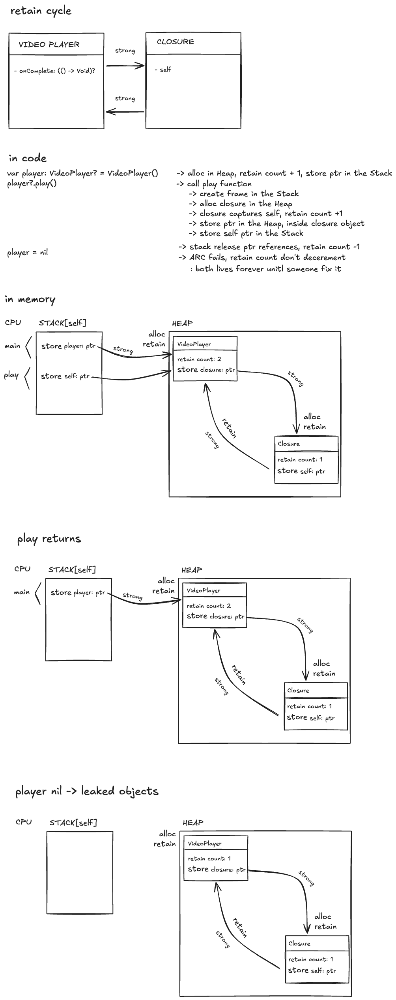

# Swift Interview Prep

Solutions to coding interview problems in Swift

## 🎯 Goal
Prepare for iOS/Software Engineer technical interviews

## 🧱 Fundamentals
```
swift-dsa/
├── data_structures/
│   ├── lab/
│   ├── mock_interview/
│   ├── weekly_project/
│   ├── ...
├── algorithms/
│   ├── lab/
│   ├── mock_interview/
│   ├── weekly_project/
	 ...
├── ios/
│   ├── memory_managment/
│   ├── concurrency/
│   └── ...
└── README.md
```


## 🐈🐈‍⬛⌨️ Catsoverflow
* [Big O Notation](https://catsoverflow.substack.com/p/big-o-notation?r=6w16u5)
* [Una pequeña intro al manejo de memoria en iOS](https://catsoverflow.substack.com/p/big-o-notation?r=6w16u5)


## 🖼️ Some screenshots

A short preview of memory managment in iOS

